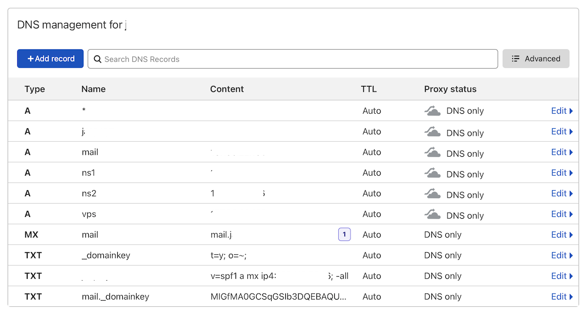

#######################################
Email and mail server
#######################################

***************************************
I am unable to send email.
***************************************

Check first if the port 25 is open for outgoing traffic. A lot of providers close port 25 on default as a security measurement to combat spam.

Run the following command in commad line:

.. code-block:: bash

    telnet ASPMX.L.GOOGLE.COM 25
    
If the connection was successfull you will see:

.. code-block:: bash

    Trying 2a00:1450:400c:c00::1b...
    Connected to ASPMX.L.GOOGLE.COM.
    Escape character is '^]'.
    220 mx.google.com ESMTP a7si1253985wrr.455 - gsmtp
    
If not you have 2 options: 
    1. Contact you provider and ask them to open port 25 for outgoing traffic.
    2. Setup a mail relay under the mail domain settings or set it up generally for the server in system settings. For this you to use an SMTP relay service like: 
        - https://aws.amazon.com/ses/
        - https://www.smtp2go.com

***************************************
I am unable to receive email.
***************************************

If yo are unable to receive email make sure you have setup your DNS propperly. If you are using Cloudflare disable the use of the proxy for the mail domain. 

When you are done you can check via https://mxtoolbox.com/MXLookup.aspx.

***************************************
How to install Rainloop
***************************************

You can install rainloop via the following command

.. code-block:: bash

    v-add-sys-rainloop
    
*****************************************
Can I login into the backend of Rainloop
*****************************************

In the root folder is an file located called .rainloop containing the username and password

.. code-block:: bash
    
    Username: admin_f0e5a5aa
    Password: D0ung4naLOptuaa
    Secret key: admin_f0e5a5aa
    
You can access the admin via https://webmail.domain.com/?admin_f0e5a5aa

And use the data supplied above. When not needed feel free to remove this file.

*****************************************
Can I use Cloudflare Proxy is email
*****************************************

No Cloudflare with Proxy enabled does not work with email. If you use email hosted on you server make sure proxy for the A record is switched of mail.domain.com is switched off. Otherwise you are not able to use receive email.
The following settings are suggested if you want to use Hestia as your mail server:

A record with name "mail" with content your server ip
A record with name "webmail" with the content of your server ip
MX record with name "mail" with content mail.domain.com
TXT record with name "@" with the content "v=spf1 a mx ip4:your ip; ~all"
TXT record with name "_domainkey" with content "t=y; o=~;"
TXT record with name "mail._domainkey" with content "DKIM key"

The DKIM key can be found via: "Mail" -> When hovering the domain go to DNS records you will see an page with the required info

