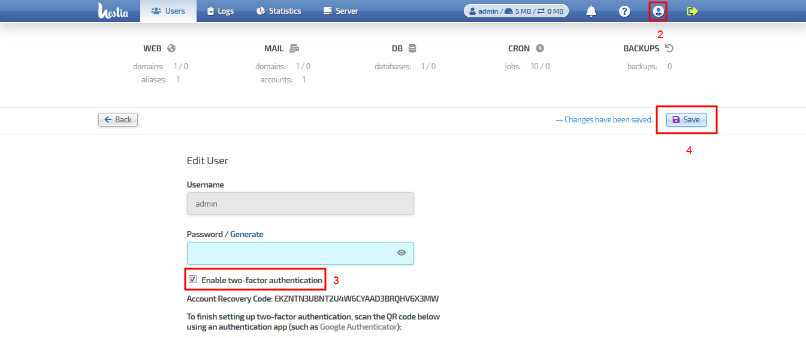
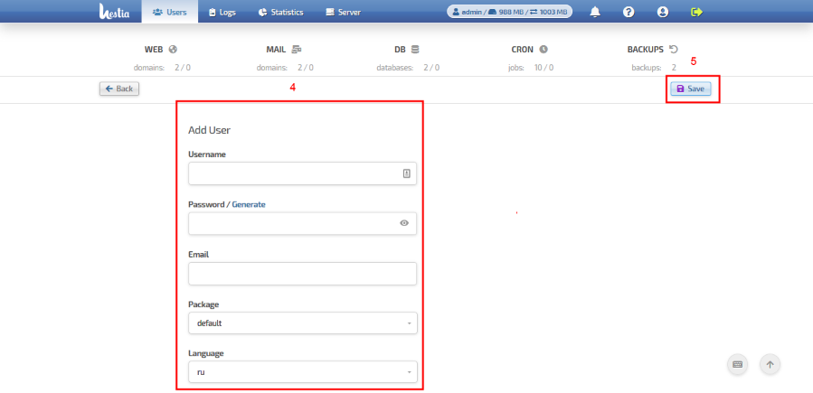

#################################
User's management guide
#################################

*****************************************
How to enable 2FA user's authentification
*****************************************

#. Login into the Control Panel as the user for whom you need to setup 2FA

#. Click at the user's icon to go to profile of user has been logged in

#. Check option **Enable two-factor authentication**

#. Click on **Save button** as shown

#. To finish setting up two-factor authentication, scan the QR code given

   using an authentication app (such as Google Authenticator).

   The 2FA is set up properly for your server.

    
*****************************************
How to add user
*****************************************

#. Login into the Control Panel as **admin** user

#. Click on the **Users** tab 

#. Click **Add user** button

#. Fill out all registration data fields on the second page as shown below

#. Click **Save** button

.. image:: ../images/img03_adding_user.png
    :width: 911px
    :align: center
    :height: 449px
    :alt: adding user
    

    
    

