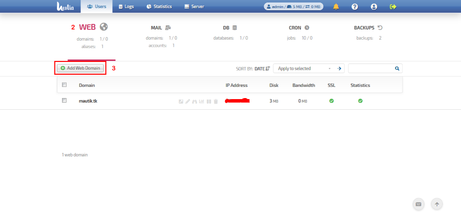

#################################
Web subsystem management guide
#################################

*****************************************
How to add a new Web domain
*****************************************
#. Log into the Control Panel as the user that you wish to create a domain under.

#. Click on the Web tab

#. Click on Add Web Domain

#. Enter the domain name in the Name field

#. Click Save

  

    
.. image:: ../images/img02_web_add_domain.png
    :width: 895px
    :align: center
    :height: 408px
    :alt: screenshot #3

